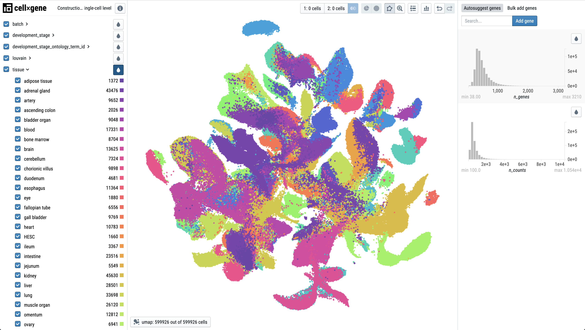

# cellxgene

Cellxgene enables scientists to annotate, publish, find, download, explore and analyze single cell datasets. Cellxgene has two offerings:

* The Data Portal ([site](https://cellxgene.cziscience.com/), [docs](portal/hosted-intro.md)) - a SaaS platform to publish, find, download, and explore single cell data.
* Cellxgene Desktop ([site](https://github.com/chanzuckerberg/cellxgene), [docs](explorer/explorer-intro.md)) - a PyPI package to explore and analyze single cell datasets.

| Task                              | Quick Start | Application |
|-----------------------------------|-------------|-------------|
| Analyze & Annotate Private Data   | [Install cellxgene](desktop/install.md) [Download an example dataset](portal/data-portal.md#download) Learn how to [analyze](explorer/features/universal-features.md) and [annotate](explorer/features/desktop-features/annotations.md) with cellxgene | Cellxgene Desktop |
| Share & Analyze Private Datasets  | Learn how to [host cellxgene Desktop Explorer](desktop/self-hosting)| Cellxgene Desktop |
| Publish Datasets                  | In pre-alpha testing. Contact [cellxgene@chanzuckerberg.com](mailto:cellxgene@chanzuckerberg.com) to learn more | Data Portal |
| Find Public Datasets              | [Finding data](portal/data-portal.md) | Data Portal |
| Download Datasets                 | [Downloading data](portal/data-portal.md#download) | Data Portal |
| Explore & Analyze Public Datasets | [Exploring data](explorer/features) | Data Portal |

## Learn more

The cellxgene documentation has six major sections:

| Section              | Purpose |
|----------------------|---------|
| Cellxgene Desktop    | How to prepare data and install or host the Cellxgene Desktop |
| Data Portal          | How to use the Data Portal |
| Data Exploration     | The Data Portal and Cellxgene Desktop have similar UIs and features; This section describes how to use both tools to explore data. |
| Contribution         | How to contribute to the cellxgene project |
| Community Extensions | Cellxgene is MIT licensed, and free to reuse. See how our user community has extended cellxgene |
| Contact              | How to get in touch with the cellxgene team to give us feedback or make feature requests |
