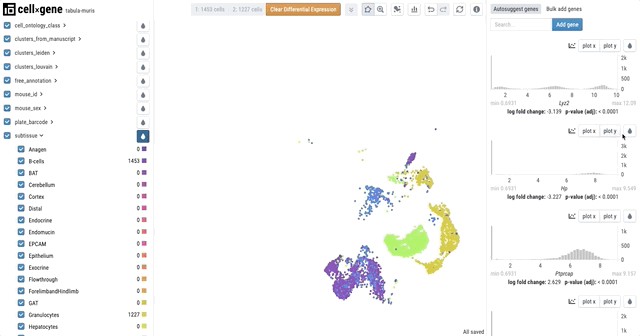

# Features

Explain that hosted explorer features are a subset of the desktop explorer features

The "gallery" gifs will be updated and moved to universal features

## Features

### Cross-filter cells and color by metadata

### Compare groups of cells with differential expression

### See how metadata and gene expression break down across categories

### Find cells where a gene is expressed

### Compare expression of multiple genes

## Interactive demos

Several groups have independently [deployed](https://github.com/chanzuckerberg/cellxgene/blob/main/docs/posts/hosted) various versions of cellxgene to the web. Check out the cool data that our users are using cellxgene to explore!

### [Kidney cell atlas](https://www.kidneycellatlas.org/)

### [Tabula muris senis](https://tabula-muris-senis.ds.czbiohub.org/)

### [Hemocytes](https://hemocytes.cellgeni.sanger.ac.uk/)

### [Melanoma](https://melanoma.cellgeni.sanger.ac.uk/)

### [CZI's own cellxgene site](https://cellxgene.cziscience.com/)

_Want us to link to your dataset here?_ [_Just send us a note!_](https://github.com/chanzuckerberg/cellxgene/blob/main/docs/posts/contact)

