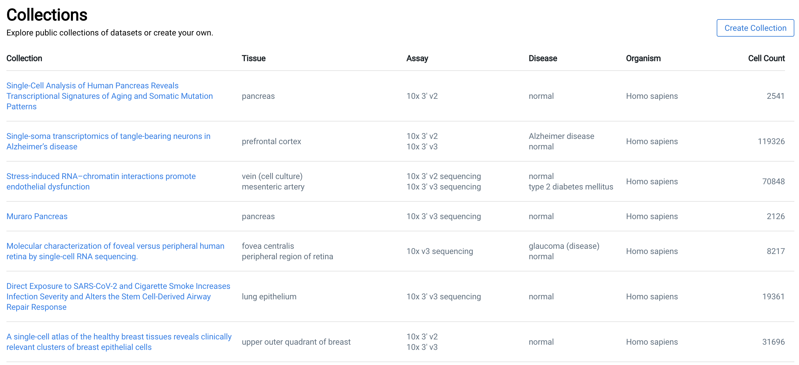

# Data Portal

### Organization

This section of the documentation aims to explain how the [cellxgene data portal](https://cellxgene.cziscience.com/) is organized and how to navigate it. When you first enter the data portal, you will be greeted by a collections page:

Generally, submissions to the data portal are organized by the publication that they are associated \(we name these Collections\). Each collection is associated with one or more datasets \(typically those that were featured in the publication\). In the image above you can also see various collection level metadata such as tissue profiled, assay used, disease, organism, and cell count. You can view the datasets associated with a collection by clicking on a particular collection name:

Now you can see that for each dataset, the same metadata that was available at the collection level, is now available in a more granular \(per dataset\) way. Importantly, we also see two new options for downloading and exploring data. These options are accessed by the last two icons in the image below:

### Download

The first icon is a download button and will bring up a dialog which enables you to download a particular dataset in a variety of ways and in different formats:

Once you click on the download icon \(  \), a download dialog will appear. Each dataset that is hosted on the cellxgene data portal is available in the major single cell data formats \(namely AnnData and Seurat\). You can choose to either download these using the blue "Download" button or via the provided curl link.

### Explore

By clicking the cellxgene explorer icon \(\), an instance of the cellxgene hosted explorer will appear in appear in a new tab in your browser. Here is an example of what that will look like:

Once you are in "explorer" mode, you will be able to color the cells by various metadata, perform complex cell selection, and more! To read about the various explorations and analyses that you can do in the cellxgene explorer, please refer to the [explorer section of this documentation]().

### Notes \(to be removed\)

~~Explain that portal is composed of:~~

~~collections~~

~~a collection~~

~~an explorer instance of a particular dataset~~ 

~~screenshots of exploring datasets~~

